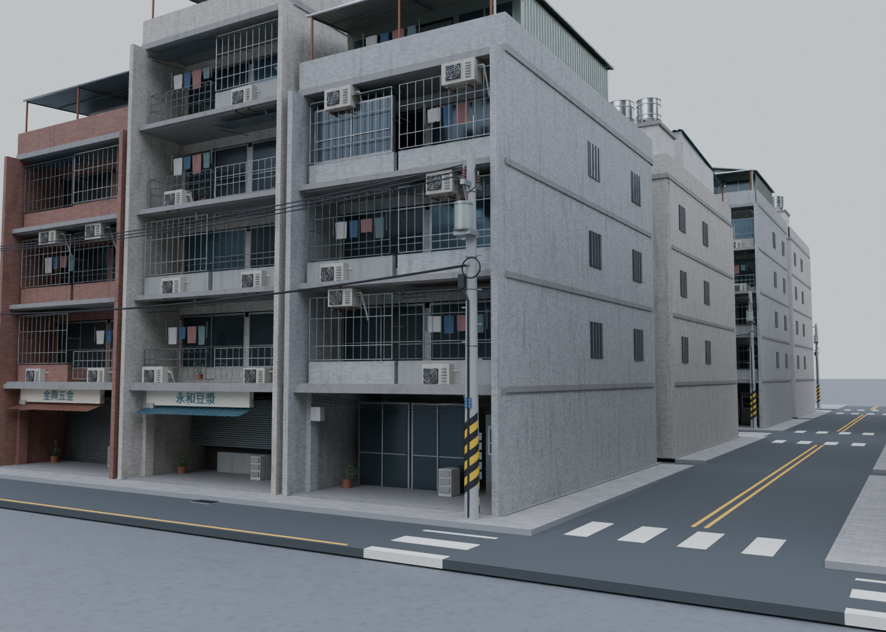
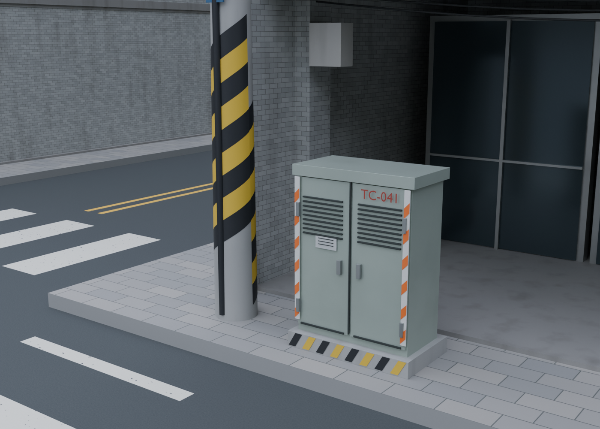

# TCity · 台灣街區生成器

在 Blender 中，將一塊已填面的區域轉為台灣住商混合街區。使用 **Geometry Nodes** 即時生成配置，附原創磁磚街屋、公寓、騎樓、陽台鐵窗、冷氣外機、繁體中文招牌、住宅頂加、水塔、曬衣與盆栽。

**版本：0.6.4，已實測 Blender 5.2.1 LTS。** 這是可使用、可繼續開發的原型，並非 iCity 官方產品或完整功能替代品。場景偏向中景與街區預覽；還不是近距離寫實建築資產庫。





## 0.6.4：台灣新式住宅社區

依建商完工照與社區街景新增獨立的 **Geometry Nodes 住宅社區生成器**：單棟、雙棟、弧邊大陽台住宅，6–24 層實際樓層組合、內縮門窗、設備遮屏、屋突、入口和共用庭園。道路、人行道、排水與電信箱隨社區尺度配置；完整基地碰到凹角或孔洞時整組略過。

直接開啟 [新式社區範例](dist/TCity_Modern_Communities.blend)，或安裝後用 `N → TCity → 新式住宅社區`。見 [操作說明](docs/modern-communities.md) 與 [真實照片／模型對照](docs/research/modern-residential.md)。新式社區目前是獨立生成器，尚未自動混排舊街屋或沿手繪曲線配置。

## 0.6.3：轉角雙立面建築

補上 0.6 路口留下的缺口：曲線道路的近似直角路口，原本被排除、留空的角地基地，現在放上簡化的轉角雙立面建築（兩片既有單面立面繞角落轉 90° 拼接、圓角磁磚牆角銜接），取代普通側牆外露或空地。新增 `Corner Buildings` 開關（預設開），可整體關閉回到 0.6 的空地行為。

僅處理近似直角路口；銳角、鈍角或偵測不到真實路口的情況維持空地。已知限制：對稱十字路口的同一個角可能被兩條街道各自判定為轉角，因而各放一棟（尚未做跨街道去重），丁字路口不受影響。細節見 [`tcity/README.md`](tcity/README.md) 與 [`docs/roadmap.md`](docs/roadmap.md)。

## 0.6.2：台灣農地、農舍與鄉間環境

新增獨立的 Geometry Nodes 農地生成器，包含不規則外框裁切、長條田區、綠稻與金黃稻、蔬菜、果園、休耕與蓄水田、田埂、農路和實體灌溉溝。第二輪依真實照片新增紅磚平房、L 形院落與磁磚農舍細節，以及路緣電桿、有支撐的架空線、自然群聚的闊葉樹與竹叢。

直接開啟 [農地範例](dist/TCity_Taiwan_Farmland.blend)，或安裝後在 `N → TCity → 台灣農地` 新增。完整操作、效能及範圍見 [農地使用說明](docs/farmland.md)，照片來源見 [鄉村實景研究](docs/research/rural-landscape.md)。可編輯不規則外框及孔洞；內部農路目前仍自動沿變形田格配置。

目前 checkout 的城市節點群組已進入 v0.7 開發版：正交 fallback 與手繪／外部曲線已收斂成單一道路管線；內建道路網會把殘餘地面切成帶 `tc_block_id` 的街廓。一般基地直接從街廓臨路頂邊抽取 frontage，再生成顯式矩形基地面、退入街廓半個 `Depth` 並繼承所屬街廓；建築與空地由面中心生成，可用 `Parcel Guides` 檢查。複合路口布林若沒有街廓頂面會自動回退中心線排；急彎上無法安全容納的基地會自動略過並在側欄警示。依不規則街廓裁切的梯形／任意形狀地籍仍在 `docs/PLAN.md` 的待辦中。以下 0.4／0.3 段落保留歷史功能介紹。

## 0.4：道路、電桿與電信箱

道路現在是有厚度的獨立瀝青網格，搭配抬高的人行道、路緣、排水格柵、人孔蓋，以及兩個方向的道路標線。電桿與電信箱沿街廓自動配置，架空線連接相鄰電桿並依垂度下垂。調整道路寬度與人行道寬度時，建築與設備位置一起更新。

建築、道路與公共設施分開控制：**Buildings 關閉後，街道仍保留**。建築 Density 不影響電桿或電信箱；電信箱另有自己的機率。關掉電桿會同時移除其架空線；道路隱藏時排水格柵與人孔蓋也隱藏。

`N → TCity` 提供三種可撤銷的預設：

- **住宅街巷**：6 m 道路、1.25 m 人行道、電桿、架空線與電信箱。
- **地下化**：10 m 道路、2 m 人行道，保留電信箱並隱藏電桿與架空線。
- **道路檢視**：隱藏建築，保留道路、人行道與沿街設施，便於檢查或建立道路網格複本。

預設保留區域、種子、樓層、住宅樣式與頂加參數。研究來源與實作對照見 [道路與沿街設施](docs/research/streets-infrastructure.md)。[街區鳥瞰](renders/streets_overview.png) 可查看整體配置。

## 0.3：台北老公寓與住宅頂加

依公視頂加報導、士林住宅實景與台北屋頂照片重新建模，研究與套用對照見 [台北住宅研究](docs/research/taipei-residential.md)。本版朝寫實方向調整：

- 內縮連續陽台、局部封窗、不同鐵窗與雨遮；冷氣有風扇、護網、支架與管線。
- 低彩度小磁磚、修補粉刷與較輕的雨水污痕；加入信箱、對講機、捲門、植物與曬衣。
- 頂加包含住居房間、半戶外露台、鋼架棚、洗衣機與管線。屋面有單斜、雙斜及局部換板組合，後側保留樓梯間、水塔群與服務空間。
- 新增 **Rooftop Addition Mix／住宅頂樓加蓋比例**：預設 0.85；0 不生成住居加蓋，但仍有水塔、樓梯間等屋頂設備。這是美術預設，並非台北實際盛行率。
- **Metal Shed Mix／獨棟鐵皮屋比例** 繼續控制地面小工廠／倉庫，台北住宅預設為 0。鐵皮屋是單層，不受住宅樓層上下限影響。

兩種比例都是每個基地的機率；固定種子並提高比例會保留原先的選取集合。`Rooftops` 同時開關頂加及屋頂設備，不會關閉獨棟鐵皮屋本體的斜屋頂。

舊的 0.1／0.2／0.3 場景：安裝 0.4 後，選取街區 → `N → TCity → 升級街區 · 道路與沿街設施`。保留區域與既有參數，新增沿街設施控制；舊節點樹和資產仍保留。升級 0.3 會共用既有住宅資產。

**配置會因新增的人行道保留寬度改變**，即使原道路寬度和種子不變，棟數與位置也可能不同。自訂舊節點邏輯不自動合併。原場景已備份於 `dist/archive/v0.1/`、`v0.2/`、`v0.3/`；`TCity_Metal_Sheds.blend` 仍是 0.2 鐵皮屋範例，可用新版升級。

## 直接試用

開啟 [`dist/TCity_Taiwan_District.blend`](dist/TCity_Taiwan_District.blend)。不必安裝外掛或執行腳本，就能在 **Modifier Properties → TCity** 調整參數。範例面積約 118 × 94 公尺，預設產生 42 棟建築、34 根電桿、10 個電信箱及 15 段架空線。

選取 `TCity • 台北住商混合街區`：

1. 在修改器調整 `Seed`、`Density`、`Road Width` 或樓層數。
2. 按 `Tab` 編輯底層區域頂點；離開編輯模式後街區自動更新。
3. 切到 Geometry Nodes 工作區，查看 `TCity • Taiwan District v0.7` 節點樹。
4. 範例包含 `Street / 街道`、`Roof homes / 頂加`、`District / 全區`、`Utilities / 沿街細節` 四台相機。`F12` 渲染。

`.blend` 內的 `Presentation` 集合是展示用相機與區域外地面。城市陰天 HDRI 已封裝在檔案內，僅用作照明與反射，背景使用純色天空。若想編輯時看到網格，打開視窗右上角 Overlays；範例初始隱藏了輔助線。

## 安裝外掛

1. Blender → **Edit → Preferences → Get Extensions**，右上角選單選 **Install from Disk**。
2. 選擇 [`dist/tcity-0.6.4.zip`](dist/tcity-0.6.4.zip)，安裝並啟用。
3. 在 3D View 按 `N` → **TCity** → **新增範例街區**。

ZIP 包含程式碼、招牌中文字型子集與 CC0 照明 HDRI，不需要下載模型、貼圖或額外安裝 Python 套件。第一次生成會建立 54 組建築變體（36 組街屋、6 組鐵皮屋、12 組轉角雙立面）；同一檔案後續區域共用資產，參數各自獨立。另有四個沿街資產：電桿、電信箱、人孔蓋、排水格柵；線纜由 GN 直接產生。

這台 Linux 的 Blender 系統套件啟動時曾回報 Extension Manager 缺少 `cattrs`。本專案已在 `.venv` 補齊開發用依賴，沒有修改系統 Python。可直接執行 `./scripts/open_demo.sh`：會打開範例並在本次 Blender 工作階段載入 TCity 側欄，不必先使用 Extension Manager，也不會儲存偏好設定。一般官方 Blender 安裝不需要這個工作站專用處理。

## 用自己的區域

1. 新增 Mesh Plane，進入 Edit Mode 改成需要的邊界。可使用凹多邊形、分離島嶼，或以面片圍出孔洞。
2. 區域必須在物件的**局部 XY 平面**，並且有面。只有封閉邊線仍需填面；只有曲線需先轉為有面的 Mesh。
3. 在 Object Mode 用 `Ctrl+A → Scale` 套用縮放，讓 1 Blender unit 對應 1 公尺。
4. 選取區域 → `N → TCity → 從選取區域生成`。輸入區域應沒有既有修改器。
5. 移動或旋轉整個物件，街區會跟著移動。道路方向跟隨物件局部 X/Y 軸。

孔洞必須由周圍面片真正留空；在單一大面上另外畫一圈邊線，不會自動變成洞。過小或過窄的區域可能沒有可容納的建築。

## 控制參數

| 參數 | 範圍 / 預設 | 行為 |
| --- | --- | --- |
| Seed | 17 | 相同邊界與設定能重現相同街區 |
| Density | 0–1 / 0.94 | 建築出現機率；未抽中的有效基地可由 Open Spaces 再利用 |
| Open Spaces | 開 | 把未建築且完整容納於區域內的沿街基地轉成停車場或口袋綠地 |
| Parking Mix | 0–1 / 0.55 | 空置基地中選擇停車場的比例；其餘為口袋綠地 |
| Parcel Guides | 關 | 顯示生成的基地面，供檢查 `tc_parcel_id` 與 `tc_block_id` |
| Frontage | 5.2–10 m / 7.2 | 建築基地面寬；同步縮放模組寬度 |
| Depth | 9–18 m / 14 | 建築基地進深；同步縮放模組深度 |
| Lots per Block | 2–10 / 4 | 每排連棟戶數；一個街廓有前後兩排 |
| Road Width | 4–20 m / 6 | 街廓之間的道路寬度，標線同步更新 |
| Alley Width | 1–6 m / 2 | 前後兩排建築之間的服務後巷 |
| Min / Max Floors | 2–7 / 4–5 | 在指定範圍選取樓層變體；上下限填反也能處理 |
| Townhouse Mix | 0–1 / 0.15 | 第二組住宅立面的比例；0 選變體 0–2，1 選變體 3–5，兩組都有陽台與逐戶細節 |
| Metal Shed Mix | 0–1 / 0 | 已占用基地中改用單層鐵皮屋的機率；獨立於街屋樓層設定 |
| Rooftop Addition Mix | 0–1 / 0.85 | 住宅頂加比例；不影響樓梯間、水塔，也不套用至獨棟鐵皮屋 |
| Boundary Setback | 0–10 m / 0.2 | 額外增加邊界保留距離 |
| Signs | 開 | 中文橫招牌、直招牌與遮雨棚 |
| Rooftops | 開 | 樓梯間、水塔、管線與住宅頂加 |
| Street Life | 開 | 住宅門前盆栽與置物架；鐵皮屋的棧板、貨箱、水桶與盆栽 |
| Buildings | 開 | 建築總開關，連同附屬物一起隱藏 |
| Ground | 開 | 道路與人行道地面總開關 |
| Road Surface | 開 | 有厚度的瀝青道路和後巷 |
| Sidewalks | 開 | 抬高的步行平台與路緣；關閉時電桿／箱體下降至道路高度 |
| Sidewalk Width | 0.8–3 m / 1.25 | 沿建築前側與街廓側邊保留寬度；加入街廓周期計算 |
| Curb Height | 0.08–0.25 m / 0.14 | 人行道頂面與設備底座高度 |
| Road Thickness | 0.06–0.6 m / 0.18 | 區域平面向下的路面厚度 |
| Road Markings | 開 | 兩個方向的中央線與路口斑馬線 |
| Road Details | 開 | 人孔蓋與路緣排水格柵；需開啟道路地面 |
| Utility Poles | 開 | 混凝土電桿、警示帶與桿上設備 |
| Pole Spacing | 8–60 m / 30 | 每段街廓內的最大跨距；實際分成等距跨段並保留兩端電桿 |
| Pole Height | 7–13 m / 9 | 桿身與架空線支點高度 |
| Overhead Wires | 開 | 同一段街廓內的五條架空線；需有電桿 |
| Cable Sag | 0–1.5 m / 0.55 | 跨中下垂量，上限另限制為桿高的 12% |
| Telecom Cabinets | 開 | 原創電信交接箱 |
| Cabinet Density | 0–1 / 0.70 | 每段街廓的箱體出現機率，固定種子可重現 |

`Townhouse Mix` 目前控制立面組合，並不是不同的土地分割模式；低樓層透天街區可以搭配樓層設成 2–4。面寬和進深會縮放整個模組，極端值也會拉伸鐵窗、設備和字形。樓層採實際樓層變體選型，不會把同一棟建築垂直拉長。

## Geometry Nodes 架構

節點樹包含七個有標籤的區段：

1. **Region**：讀取原始面的邊界盒與真正的邊界邊線。
2. **Parcels**：依街廓週期建立基地點，安排前後兩排建築與朝街方向。
3. **Boundary**：向下 Raycast 確認基地位於區域內，再用邊界距離保留完整建築範圍；套用隨機密度，儲存基地 ID、樓層與資產索引。
4. **Kit**：用 Collection Info / Instance on Points 選取建築與相應細節，保持實例輸出。
5. **Streets**：封閉區域立體、平台立體與布林裁切，分開輸出道路及鋪面。
6. **Utilities**：沿街錨點、電桿、電信箱、排水格柵和人孔蓋，與建築密度獨立。
7. **Wires**：確認兩端電桿及區域邊界淨空後，生成有垂度的管狀架空線。

邊界距離採基地外接圓：`0.5 × sqrt(面寬² + 進深²) + 額外退縮`。這是保守的完整容納判斷，能處理凹角與孔洞，但會在某些邊界留下比必要更大的空地。第一版不切斷或裁掉建築。

Python 只建立原創資產、節點樹與 UI；**修改參數與區域時，配置由 Geometry Nodes 評估**，沒有逐幀 Python handler。道路立體裁切比舊版的單面材質需要更多運算，建議先使用 100–200 m 區域。街屋資產索引為 `(樓層 - 2) × 6 + 立面變體`（0–35），鐵皮屋為 36–41，曲線道路近似直角路口用的轉角雙立面建築為 42–53（`(樓層 - 2) × 2 + 鏡像方向`）；五組集合（Buildings、Signs、Roofs、Street life、Additions）的名稱排序和索引一一對齊。`tc_parcel_id`、`tc_block_id`、`tc_floors`、`tc_asset`、`tc_is_shed` 會由基地面傳給後續幾何。實體網格上的 `tc_layer` 可區分道路 1、人行道 2、架空線 3、殘餘地面 4、停車場 5、口袋綠地 6、基地檢查面 7；`tc_span_id` 則辨認線路跨段。

## 匯出

點 **建立實體網格複本**。外掛會保留原程序化物件，建立 `• Baked` 網格複本；複本初始隱藏於視窗和渲染，避免與來源重疊。到 Outliner 將來源隱藏，再開啟複本即可檢查或匯出。

道路標線與磁磚是 Blender 程序化材質，不是 UV 貼圖。FBX / glTF 不會自動完整攜帶這些 shader；輸出遊戲引擎前需另行烘焙材質。網格複本操作只實體化幾何，不做材質烘焙。

## 現階段範圍

- 正交雙排街廓；輸入為平面。尚無曲線道路、坡地貼合、OSM / 真實地籍或使用者道路曲線。
- 54 組原創建築組合（6 種立面 × 2–7 樓，加上 6 種單層鐵皮屋與 12 組簡化轉角雙立面），不是掃描資產。轉角雙立面僅用於曲線道路的近似直角路口，且是既有立面拼接而非專用模型；尚無廟宇、夜市攤位；高樓使用上述獨立新式社區生成器。
- 道路標線是展示用程序化材質，並非交通工程配置；不含交通動畫、路線導航或正式道路網路資料。
- 空置基地保留鋪面平台，尚未自動生成公園或停車場。
- 建議先使用 100–200 m 的區域。新增區域時邊長上限 1,000 m；GN 安全上限為 20,000 個候選基地。建立後若把網格拉得更大，可能觸及此上限。
- 邊界盒決定街廓起點；大幅修改邊界盒後，網格配置與基地 ID 會重新排列。
- 面向開發的可用原型；美術精度、資產種類和道路功能尚未達到成熟商用城市生成器的規模。

## 開發與驗證

```bash
blender -b --factory-startup --python-exit-code 1 --python scripts/build_demo.py -- --render
blender -b --factory-startup --python-exit-code 1 --python tests/test_blender.py
blender -b --factory-startup --python-exit-code 1 --python tests/test_infrastructure.py
blender -b --factory-startup --python-exit-code 1 --python tests/test_modern.py
blender -b --factory-startup --python-exit-code 1 --python tests/test_modern_demo.py
blender -b --factory-startup --python-exit-code 1 --python tests/test_package.py
blender -b --factory-startup --python-exit-code 1 --python tests/test_upgrade.py
blender -b --factory-startup --python-exit-code 1 --python tests/test_demo.py
blender --command extension build --source-dir tcity --output-dir dist
blender --command extension validate dist/tcity-0.6.4.zip
```

主要檔案：`tcity/residential.py` 台北住宅與頂加、`tcity/surfaces.py` 程序材質、`tcity/lived_in.py` 生活細節、`tcity/assets.py` 資產共用工具、`tcity/infrastructure.py` 道路與連線節點、`tcity/street_assets.py` 沿街資產、`tcity/nodes.py` 主節點建構、`tcity/__init__.py` 外掛 UI / 操作、`scripts/build_demo.py` 展示場景、`tests/test_blender.py` 實機整合測試。

測試以 Blender evaluated depsgraph 檢查實際輸出，包括：固定種子、密度、樓層上下限、開關、立面比例、道路尺寸、凹形區域、孔洞、物件位移與旋轉、過小區域、錯誤輸入，以及保留來源的幾何烘焙。邊界測試遍歷所有實例的實際模型頂點。結果保存於 [`dist/test_results.json`](dist/test_results.json)。

交付的 `.blend` 已在未匯入外掛的工作階段開啟，驗證四台相機、封裝 HDRI 與頂加比例的即時變化，見 [`dist/demo_test_results.json`](dist/demo_test_results.json)。

ZIP 另通過 Blender extension validate，並解壓到臨時目錄獨立載入、註冊 UI、以 operator 生成街區，確認不依賴原始碼目錄或系統中文字型。結果見 [`dist/package_test_results.json`](dist/package_test_results.json)。

住宅／區域的 18 項測試保留；0.4 另有 14 項沿街系統測試，涵蓋獨立層、設備高度、種子機率、電線兩端接桿、路面閉合性、凹角、孔洞及窄缺口。結果見 [`dist/infrastructure_test_results.json`](dist/infrastructure_test_results.json)。實際 0.1／0.2／0.3 場景的升級結果見 [`dist/upgrade_test_results.json`](dist/upgrade_test_results.json)。

來源與美術規則見 [docs/references.md](docs/references.md)；後續開發建議見 [docs/roadmap.md](docs/roadmap.md)。程式與原創模型為 GPL-3.0-or-later；附帶的 Noto 衍生招牌字型子集另依 SIL OFL 授權。參考照片未打包進資產或作為模型貼圖。隨附 Poly Haven Urban Street 03 HDRI 為 CC0，來源與授權見 `tcity/environment/CREDITS.txt`。
